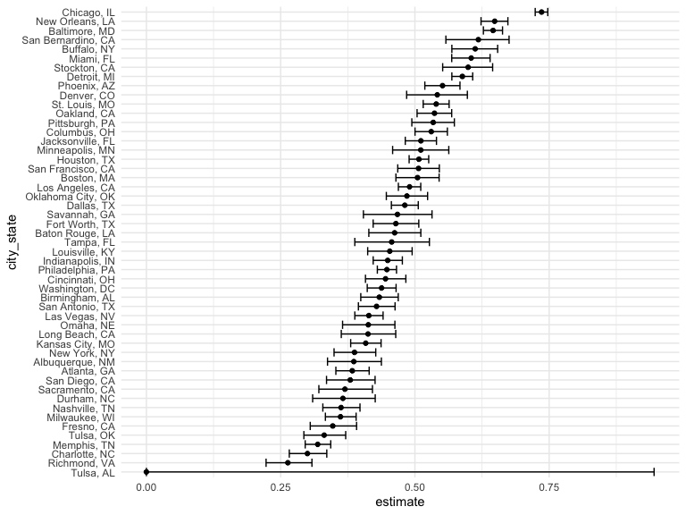
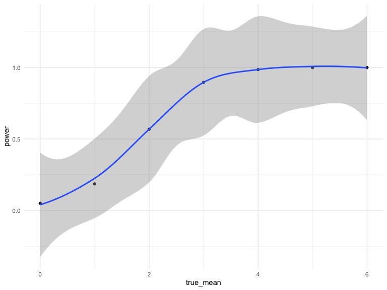
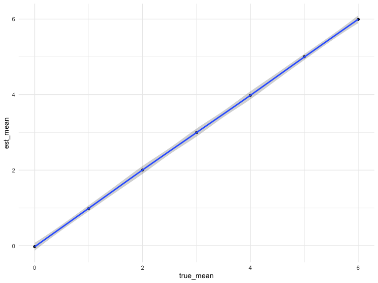
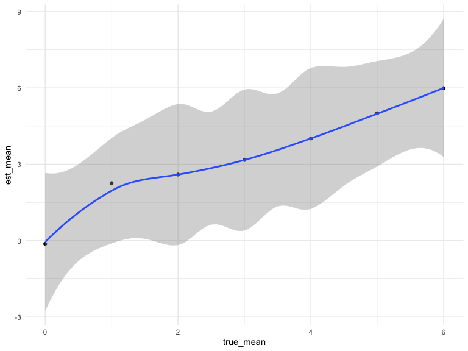

Homework 5
================
Lincole Jiang
2022-11-16

Problem 1

*omited.*

Problem 2

In this problem, we investigate the data posted by *The Washington Post*
on homocides in 50 large U.S. cities. We first import the dataset and
provide an overview.

``` r
# import datset and create city_state variable
homocide <- read_csv("./data/homicide-data.csv")
```

    ## Rows: 52179 Columns: 12
    ## ── Column specification ────────────────────────────────────────────────────────
    ## Delimiter: ","
    ## chr (9): uid, victim_last, victim_first, victim_race, victim_age, victim_sex...
    ## dbl (3): reported_date, lat, lon
    ## 
    ## ℹ Use `spec()` to retrieve the full column specification for this data.
    ## ℹ Specify the column types or set `show_col_types = FALSE` to quiet this message.

``` r
head(homocide)
```

    ## # A tibble: 6 × 12
    ##   uid    repor…¹ victi…² victi…³ victi…⁴ victi…⁵ victi…⁶ city  state   lat   lon
    ##   <chr>    <dbl> <chr>   <chr>   <chr>   <chr>   <chr>   <chr> <chr> <dbl> <dbl>
    ## 1 Alb-0…  2.01e7 GARCIA  JUAN    Hispan… 78      Male    Albu… NM     35.1 -107.
    ## 2 Alb-0…  2.01e7 MONTOYA CAMERON Hispan… 17      Male    Albu… NM     35.1 -107.
    ## 3 Alb-0…  2.01e7 SATTER… VIVIANA White   15      Female  Albu… NM     35.1 -107.
    ## 4 Alb-0…  2.01e7 MENDIO… CARLOS  Hispan… 32      Male    Albu… NM     35.1 -107.
    ## 5 Alb-0…  2.01e7 MULA    VIVIAN  White   72      Female  Albu… NM     35.1 -107.
    ## 6 Alb-0…  2.01e7 BOOK    GERALD… White   91      Female  Albu… NM     35.2 -107.
    ## # … with 1 more variable: disposition <chr>, and abbreviated variable names
    ## #   ¹​reported_date, ²​victim_last, ³​victim_first, ⁴​victim_race, ⁵​victim_age,
    ## #   ⁶​victim_sex

As shown, without the added variable of city_state, the dataset contains
11 variables and 52179 observations. Specifically, the dataset contains
the UID of the homocide victim, their first and last name, date
reported, race, age, sex; city, state, and coordinates of discovery; as
well as the disposition of the case.

Now, we create a city_state variable and summarize within cities to
obtain the total number of homocides and the number of unsolved
homocides.

``` r
# Create city_state variable
homocide <- homocide %>% 
  mutate(
    state = replace(state, state == "wI", "WI"),
    city_state = paste(city, state, sep = ", ")
    )

# Summarise within cities to obtain number of total cases and unsolved cases
homocide_disposition <- homocide %>% 
  group_by(city_state) %>%
  summarise(total_cases = n(), 
            unsolved_cases = sum(disposition == "Closed without arrest" | disposition == "Open/No arrest"))

# Display results
head(homocide_disposition)
```

    ## # A tibble: 6 × 3
    ##   city_state      total_cases unsolved_cases
    ##   <chr>                 <int>          <int>
    ## 1 Albuquerque, NM         378            146
    ## 2 Atlanta, GA             973            373
    ## 3 Baltimore, MD          2827           1825
    ## 4 Baton Rouge, LA         424            196
    ## 5 Birmingham, AL          800            347
    ## 6 Boston, MA              614            310

Now, for the city of Baltimore, MD exclusively, we run the prop.test
function to estimate the proportion of homocides that are unsolved.

``` r
# use prop.test to estimate proportions; pull test result
test_bal = homocide_disposition %>%
  filter(city_state == "Baltimore, MD") %>%
  mutate(prop_test = map2(unsolved_cases, total_cases, ~prop.test(.x, .y) %>%
                         broom::tidy())) %>% 
  unnest() %>%
  select(city_state, estimate, lower_CI = conf.low, upper_CI = conf.high)

test_bal
```

    ## # A tibble: 1 × 4
    ##   city_state    estimate lower_CI upper_CI
    ##   <chr>            <dbl>    <dbl>    <dbl>
    ## 1 Baltimore, MD    0.646    0.628    0.663

We now run this test for every city in the data set and extract the
proportion and confidence interval for each.

``` r
# Run prop.test for each city
test_full = homocide_disposition %>% 
  mutate(prop_test = map2(unsolved_cases, total_cases, ~prop.test(.x, .y) %>%
                         broom::tidy())) %>% 
  unnest() %>% #pull estimated proportion and confidence intervals
  select(city_state, estimate, lower_CI = conf.low, upper_CI = conf.high)

# Display result
head(test_full)
```

    ## # A tibble: 6 × 4
    ##   city_state      estimate lower_CI upper_CI
    ##   <chr>              <dbl>    <dbl>    <dbl>
    ## 1 Albuquerque, NM    0.386    0.337    0.438
    ## 2 Atlanta, GA        0.383    0.353    0.415
    ## 3 Baltimore, MD      0.646    0.628    0.663
    ## 4 Baton Rouge, LA    0.462    0.414    0.511
    ## 5 Birmingham, AL     0.434    0.399    0.469
    ## 6 Boston, MA         0.505    0.465    0.545

Finally, for problem 2, we create a plot that shows the estimates and
the CIs for each city, while organizing the cities according to the
proportion of unsolved homicides.

``` r
test_full %>%
  mutate(city_state = fct_reorder(city_state, estimate)) %>%
  ggplot(aes(x = city_state, y = estimate, ymin = lower_CI, ymax = upper_CI)) +
  geom_point() + 
  geom_errorbar() + 
  coord_flip() +
  theme(legend.position = "none")
```



### Problem 3

For this problem, we consider statistical power, or the probability that
a null hypothesis is rejected given that it is false, which is important
has it indicates whether a true effect will be detected. It is dependent
on several factors including sample size, effect size, and error
variance. We conduct a simulation to explore power in a one-sample
t-test. Specifically, we write a function that takes in a value for
$\mu0$ to generate 5000 datasets of size 30 with distribution
$\sim \text{Normal}(\mu = \mu0, \sigma = 5)$. We first test the efficacy
of the function on $\mu = 0$.

``` r
# sim_mean_p_value simulates a normal distribution n = 30, mean = mu, sd = 5 and returns the sample mean and p-value
sim_mean_pvalue = function(mu, n = 30, sigma = 5) {
  
  sim_data = tibble(
    x = rnorm(n = 30, mean = mu, sd = sigma),
  )
  
  sim_data %>%  
    t.test() %>% 
    broom::tidy() %>% 
    select(mu_hat = estimate, 
           p_value = p.value)
  
}

# map sim_mean_pvalue function over mu column to replicate 5000 times.
sim_results_df = 
  expand_grid(
    true_mean = 0,
    iter = 1:5000
  ) %>%
  mutate(
    estimate_df = map(true_mean, sim_mean_pvalue)
  ) %>%
  unnest(estimate_df)
```

We now repeat the process for $\mu = {1, 2, 3, 4, 5, 6}$ to get the more
expansive dataset.

``` r
sim_results_df = 
  expand_grid(
    true_mean = c(0, 1, 2, 3, 4, 5, 6),
    iter = 1:5000
  ) %>%
  mutate(
    estimate_df = map(true_mean, sim_mean_pvalue)
  ) %>%
  unnest(estimate_df) %>%
  select(-iter)
```

At this point, we try to visualize the association between effect size
and power by plotting the power of the test on the y axis and the true
value of mu on the x axis.

``` r
sim_results_df %>%
  filter(p_value < 0.05) %>%
  group_by(true_mean) %>%
  summarise(power = n()/5000) %>%
  ggplot(aes(x = true_mean, y = power)) +
  geom_point() +
  geom_smooth()
```

    ## `geom_smooth()` using method = 'loess' and formula 'y ~ x'



From our results it is exceptionally clear that power increases with
effect size.

Finally, we make a plot showing the average estimate of $\hat\mu$ on the
y axis and the true value of $\mu$ on the x axis.

``` r
sim_results_df %>% 
  group_by(true_mean) %>%
  summarise(est_mean = mean(mu_hat)) %>%
  ggplot(aes(x = true_mean, y = est_mean)) +
  geom_point() +
  geom_smooth()
```

    ## `geom_smooth()` using method = 'loess' and formula 'y ~ x'



Finally, a plot showing the average estimate of $\hat\mu$ on the y axis
and the true value of $\mu$ on the x axis only in samples for which the
null was rejected.

``` r
sim_results_df %>% 
  filter(p_value < 0.05) %>%
  group_by(true_mean) %>%
  summarise(est_mean = mean(mu_hat)) %>%
  ggplot(aes(x = true_mean, y = est_mean)) +
  geom_point() +
  geom_smooth()
```

    ## `geom_smooth()` using method = 'loess' and formula 'y ~ x'



As we can see, the sample average of $\hat\mu$ across tests for which
the null is rejected is not quite equal to the true value of $\hat\mu$.
This is because that according to our hypothesis, when H0 is rejected or
p-value \< 0.05, there is only a small chance (in this case 5%) that the
sample mean is equivalent to the true mean. In such cases it is only
natural that we observe discrepancies between the sample mean and the
true mean.
